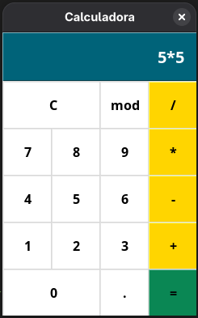

# Título principal

**Parágrafo** __comum__.

## Funcionalidades

*Funcionalidades* do _app_

###### Melhorias

*Melhoria 1, **melhoria** 2*

### Linguagens do projeto

* WEB
    * HTML
    * CSS
    * JavaScript
* PHP
* MySQL

### Funcionalidades

1. Login
    1. Conta do Google
    2. Conta do Facebook
    3. Conta da Amazon
2. Alterar senha
3. Histórico de compras

### Imagem local

### Imagem externa

### Links interessantes

[Google](https://www.google.com)

https://www.google.com

Perfil: https://github.com/ChristianGCa